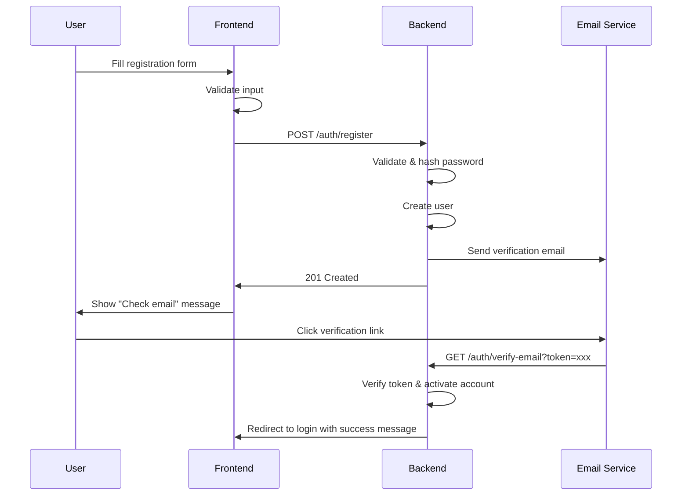
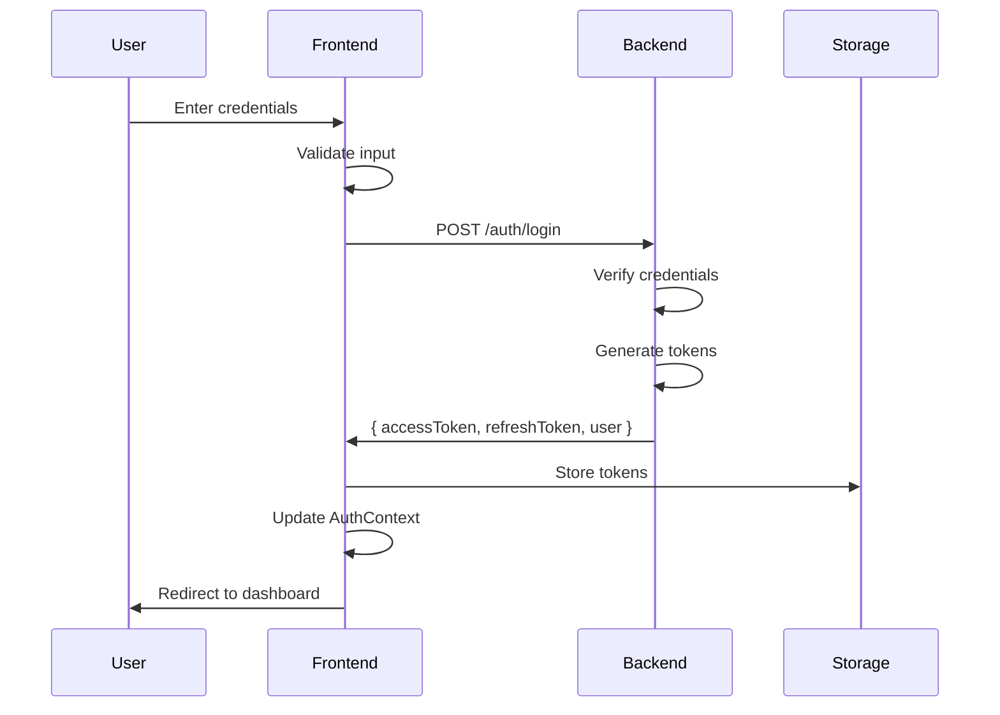
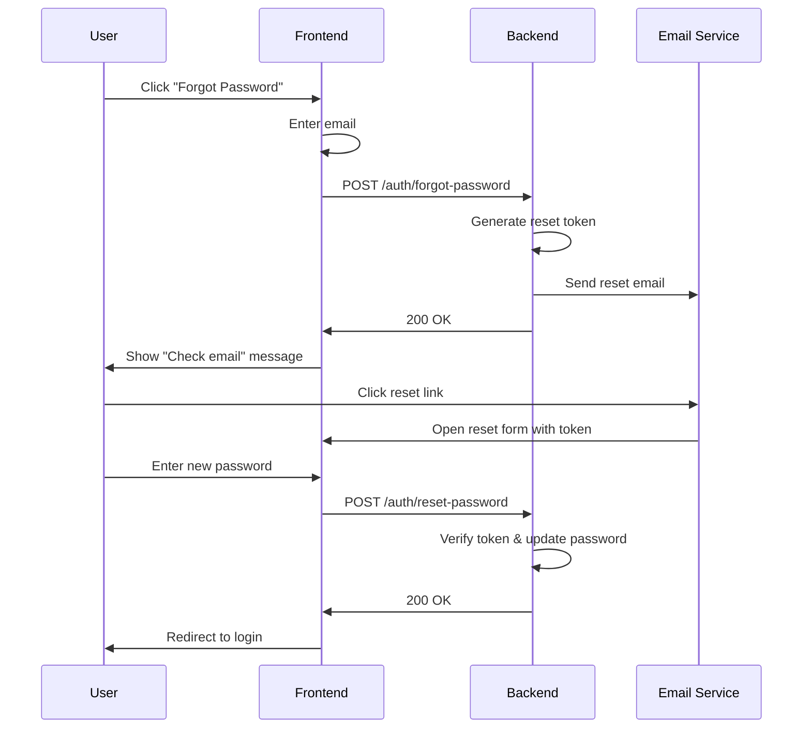
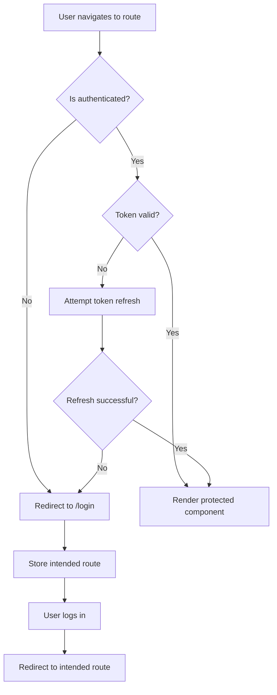

# Authentication System Specification

## Document Information
- **Version**: 1.0
- **Last Updated**: 2025-12-23
- **Status**: Draft
- **Author**: Claude Code
- **Project**: Wiowa Tech Studio - Frontend Authentication

## Table of Contents
1. [Overview](#overview)
2. [Requirements](#requirements)
3. [Architecture](#architecture)
4. [Authentication Flow](#authentication-flow)
5. [UI/UX Specifications](#uiux-specifications)
6. [Security Considerations](#security-considerations)
7. [Technical Implementation](#technical-implementation)
8. [API Integration](#api-integration)
9. [Error Handling](#error-handling)
10. [Testing Strategy](#testing-strategy)
11. [Deployment Plan](#deployment-plan)

---

## Overview

### Purpose
This document specifies the implementation of a comprehensive authentication system for the Wiowa Tech Studio frontend applications, enabling user registration, login, and session management.

### Scope
- User registration with email/password
- User login with email/password
- Session management and token handling
- Password reset functionality
- Protected routes and authorization
- User profile management
- OAuth 2.0 social login (optional future enhancement)

### Goals
- Secure user authentication and authorization
- Seamless user experience across all applications
- Token-based authentication with JWT
- Persistent sessions across browser refreshes
- Integration with existing Module Federation architecture

---

## Requirements

### Functional Requirements

#### FR1: User Registration
- **FR1.1**: Users can register with email and password
- **FR1.2**: Email validation (format and uniqueness)
- **FR1.3**: Password strength validation (min 8 chars, uppercase, lowercase, number, special character)
- **FR1.4**: Email verification via confirmation link
- **FR1.5**: Display registration errors clearly
- **FR1.6**: Redirect to login after successful registration

#### FR2: User Login
- **FR2.1**: Users can log in with email and password
- **FR2.2**: "Remember me" option for extended sessions
- **FR2.3**: Display login errors clearly
- **FR2.4**: Redirect to intended destination after login
- **FR2.5**: Automatic session restoration on page refresh
- **FR2.6**: Account lockout after 5 failed login attempts (15-minute cooldown)

#### FR3: Password Management
- **FR3.1**: "Forgot password" functionality
- **FR3.2**: Password reset via email link
- **FR3.3**: Password change from user settings
- **FR3.4**: Current password verification for password changes
- **FR3.5**: Password reset token expiration (1 hour)

#### FR4: Session Management
- **FR4.1**: JWT-based authentication tokens
- **FR4.2**: Access token (15 minutes expiration)
- **FR4.3**: Refresh token (7 days expiration, 30 days with "remember me")
- **FR4.4**: Automatic token refresh before expiration
- **FR4.5**: Logout functionality (client and server-side token invalidation)
- **FR4.6**: Session timeout handling with warning modal

#### FR5: Protected Routes
- **FR5.1**: Route-level authentication guards
- **FR5.2**: Redirect to login for unauthenticated users
- **FR5.3**: Return to intended route after authentication
- **FR5.4**: Public routes accessible without authentication

#### FR6: User Profile
- **FR6.1**: View user profile information
- **FR6.2**: Update profile (name, avatar)
- **FR6.3**: Email change with verification
- **FR6.4**: Account deletion with confirmation

### Non-Functional Requirements

#### NFR1: Security
- **NFR1.1**: All authentication requests over HTTPS
- **NFR1.2**: Passwords hashed with bcrypt (backend)
- **NFR1.3**: JWT tokens signed with RS256
- **NFR1.4**: CSRF protection for state-changing operations
- **NFR1.5**: XSS protection through proper sanitization
- **NFR1.6**: Rate limiting on authentication endpoints
- **NFR1.7**: Secure storage of tokens (httpOnly cookies preferred, localStorage fallback)

#### NFR2: Performance
- **NFR2.1**: Login response time < 500ms
- **NFR2.2**: Token refresh without user interruption
- **NFR2.3**: Minimal bundle size impact (< 50KB gzipped)

#### NFR3: Usability
- **NFR3.1**: Clear error messages
- **NFR3.2**: Loading states for all async operations
- **NFR3.3**: Accessible forms (WCAG 2.1 AA compliant)
- **NFR3.4**: Mobile-responsive authentication UI

#### NFR4: Compatibility
- **NFR4.1**: Works with Module Federation architecture
- **NFR4.2**: Shared authentication state across federated apps
- **NFR4.3**: Browser support: Chrome, Firefox, Safari, Edge (last 2 versions)

---

## Architecture

### High-Level Architecture

```
┌─────────────────────────────────────────────────────────────┐
│                     Frontend Applications                    │
│  ┌──────────────┐              ┌──────────────┐            │
│  │   myhost     │              │  mymemory    │            │
│  │  (Port 4200) │              │  (Port 4201) │            │
│  └──────┬───────┘              └──────┬───────┘            │
│         │                              │                     │
│         └──────────────┬───────────────┘                     │
│                        │                                     │
│         ┌──────────────▼───────────────┐                    │
│         │   Shared Auth Library        │                    │
│         │  (@wiowa/auth or auth lib)   │                    │
│         │  - AuthProvider              │                    │
│         │  - useAuth hook              │                    │
│         │  - Protected routes          │                    │
│         │  - Token management          │                    │
│         └──────────────┬───────────────┘                    │
└────────────────────────┼────────────────────────────────────┘
                         │
                         │ HTTP/HTTPS
                         │
              ┌──────────▼──────────┐
              │   Backend API       │
              │                     │
              │  /auth/register     │
              │  /auth/login        │
              │  /auth/logout       │
              │  /auth/refresh      │
              │  /auth/reset-pwd    │
              │  /user/profile      │
              └─────────────────────┘
```

### Component Architecture

```
src/
├── libs/
│   └── shared/
│       └── auth/
│           ├── src/
│           │   ├── index.ts
│           │   ├── components/
│           │   │   ├── LoginForm.tsx
│           │   │   ├── RegisterForm.tsx
│           │   │   ├── ForgotPasswordForm.tsx
│           │   │   ├── ResetPasswordForm.tsx
│           │   │   ├── ProtectedRoute.tsx
│           │   │   └── SessionTimeoutModal.tsx
│           │   ├── context/
│           │   │   ├── AuthContext.tsx
│           │   │   └── AuthProvider.tsx
│           │   ├── hooks/
│           │   │   ├── useAuth.ts
│           │   │   ├── useLogin.ts
│           │   │   ├── useRegister.ts
│           │   │   └── useTokenRefresh.ts
│           │   ├── services/
│           │   │   ├── authService.ts
│           │   │   ├── tokenService.ts
│           │   │   └── apiClient.ts
│           │   ├── types/
│           │   │   └── auth.ts
│           │   └── utils/
│           │       ├── validation.ts
│           │       └── storage.ts
│           ├── tsconfig.json
│           └── project.json
```

### Data Flow

#### Login Flow
```
User Input → LoginForm → useLogin hook → authService.login()
                                              ↓
                                         Backend API
                                              ↓
                                    { accessToken, refreshToken, user }
                                              ↓
                                       tokenService.store()
                                              ↓
                                    AuthContext.setUser()
                                              ↓
                                      Redirect to Dashboard
```

#### Token Refresh Flow
```
API Request → Interceptor checks token expiration
                     ↓
              Token expired?
                     ↓ YES
         authService.refreshToken()
                     ↓
              New access token
                     ↓
         Update stored token
                     ↓
         Retry original request
```

---

## Authentication Flow

### Registration Flow



### Login Flow



### Password Reset Flow



### Protected Route Flow



---

## UI/UX Specifications

### Design System Integration

All authentication components will use the existing `@wiowa-tech-studio/ui` component library and follow the established design tokens:

- **Colors**: Use existing theme colors (primary, secondary, muted, etc.)
- **Typography**: Use existing font scale and weights
- **Spacing**: Follow established spacing scale
- **Components**: Leverage existing Button, Card, Input components

### Login Screen

#### Layout
```
┌─────────────────────────────────────────┐
│                                         │
│         [Logo/Brand]                    │
│                                         │
│         Welcome Back                    │
│         Log in to your account          │
│                                         │
│    ┌─────────────────────────────┐     │
│    │ Email                       │     │
│    │ [email input field]         │     │
│    └─────────────────────────────┘     │
│                                         │
│    ┌─────────────────────────────┐     │
│    │ Password                    │     │
│    │ [password input field]  👁   │     │
│    └─────────────────────────────┘     │
│                                         │
│    ☐ Remember me    Forgot password?   │
│                                         │
│    ┌─────────────────────────────┐     │
│    │        Log In               │     │
│    └─────────────────────────────┘     │
│                                         │
│    Don't have an account? Sign up      │
│                                         │
│    ─────────── or ───────────          │
│                                         │
│    [ Continue with Google ]            │
│    [ Continue with GitHub ]            │
│                                         │
└─────────────────────────────────────────┘
```

#### Specifications
- **Container**: Centered card, max-width 450px
- **Spacing**: 24px between form sections
- **Inputs**: Full-width, 48px height
- **Button**: Full-width, 48px height, primary color
- **Links**: Secondary color, hover underline
- **Error messages**: Red text below field, 14px
- **Loading state**: Spinner in button, disabled inputs

### Registration Screen

#### Layout
```
┌─────────────────────────────────────────┐
│                                         │
│         [Logo/Brand]                    │
│                                         │
│         Create Account                  │
│         Join us today                   │
│                                         │
│    ┌─────────────────────────────┐     │
│    │ Full Name                   │     │
│    │ [text input field]          │     │
│    └─────────────────────────────┘     │
│                                         │
│    ┌─────────────────────────────┐     │
│    │ Email                       │     │
│    │ [email input field]         │     │
│    └─────────────────────────────┘     │
│                                         │
│    ┌─────────────────────────────┐     │
│    │ Password                    │     │
│    │ [password input field]  👁   │     │
│    │ [Password strength meter]   │     │
│    └─────────────────────────────┘     │
│                                         │
│    ┌─────────────────────────────┐     │
│    │ Confirm Password            │     │
│    │ [password input field]  👁   │     │
│    └─────────────────────────────┘     │
│                                         │
│    ☐ I agree to Terms & Privacy        │
│                                         │
│    ┌─────────────────────────────┐     │
│    │      Create Account         │     │
│    └─────────────────────────────┘     │
│                                         │
│    Already have an account? Log in     │
│                                         │
└─────────────────────────────────────────┘
```

#### Password Strength Meter
- **Weak**: Red bar, 25% width - "Weak password"
- **Fair**: Orange bar, 50% width - "Fair password"
- **Good**: Yellow bar, 75% width - "Good password"
- **Strong**: Green bar, 100% width - "Strong password"

Criteria displayed below:
- ✓ At least 8 characters
- ✓ Contains uppercase letter
- ✓ Contains lowercase letter
- ✓ Contains number
- ✓ Contains special character

### Forgot Password Screen

```
┌─────────────────────────────────────────┐
│                                         │
│         [Logo/Brand]                    │
│                                         │
│         Reset Password                  │
│         Enter your email to receive     │
│         a password reset link           │
│                                         │
│    ┌─────────────────────────────┐     │
│    │ Email                       │     │
│    │ [email input field]         │     │
│    └─────────────────────────────┘     │
│                                         │
│    ┌─────────────────────────────┐     │
│    │    Send Reset Link          │     │
│    └─────────────────────────────┘     │
│                                         │
│    ← Back to login                     │
│                                         │
└─────────────────────────────────────────┘
```

### Session Timeout Modal

```
┌─────────────────────────────────────────┐
│  ⚠️  Session Expiring                   │
│                                         │
│  Your session will expire in 60 seconds│
│  due to inactivity. Would you like to  │
│  stay logged in?                       │
│                                         │
│  [  Log Out  ]    [ Stay Logged In ]   │
└─────────────────────────────────────────┘
```

- Appears 60 seconds before token expiration
- Countdown timer visible
- Auto-logout if no action taken

### User Profile Menu

```
┌──────────────────────┐
│  [Avatar]  John Doe  │
│  john@example.com    │
├──────────────────────┤
│  👤 Profile          │
│  ⚙️  Settings         │
│  📊 Dashboard        │
├──────────────────────┤
│  🚪 Log Out          │
└──────────────────────┘
```

### Loading States

- **Button loading**: Spinner replaces text, button disabled
- **Form loading**: Overlay with spinner, inputs disabled
- **Page loading**: Full-page spinner with "Authenticating..."

### Error States

```
┌─────────────────────────────────────────┐
│ Email                                   │
│ [email input field - red border]        │
│ ❌ Invalid email format                 │
└─────────────────────────────────────────┘
```

- Red border on invalid field
- Error icon + message below field
- Red text, 14px font size

### Success States

```
┌─────────────────────────────────────────┐
│  ✅ Account created successfully!       │
│  Please check your email to verify      │
│  your account.                          │
└─────────────────────────────────────────┘
```

- Green background banner
- Auto-dismiss after 5 seconds
- Check icon + success message

---

## Security Considerations

### Password Security

#### Client-Side
- Minimum 8 characters validation
- Complexity requirements enforced
- Password visibility toggle
- No password in URL parameters
- Clear password from memory after submission

#### Server-Side (Backend Requirements)
- Bcrypt hashing with salt (cost factor 12)
- No password in logs or error messages
- Password history (prevent last 5 passwords)
- Account lockout after failed attempts

### Token Security

#### Access Token
- **Type**: JWT (JSON Web Token)
- **Algorithm**: RS256 (RSA Signature with SHA-256)
- **Expiration**: 15 minutes
- **Storage**: Memory (variable) or sessionStorage
- **Payload**:
  ```json
  {
    "sub": "user-id",
    "email": "user@example.com",
    "name": "User Name",
    "role": "user",
    "iat": 1640000000,
    "exp": 1640000900
  }
  ```

#### Refresh Token
- **Type**: Opaque token or JWT
- **Expiration**: 7 days (30 days with "remember me")
- **Storage**: httpOnly cookie (preferred) or localStorage (with encryption)
- **Rotation**: New refresh token issued on each refresh
- **Revocation**: Server-side blacklist for logout

### CSRF Protection

- **State Parameter**: Random string in OAuth flows
- **SameSite Cookies**: `SameSite=Strict` for auth cookies
- **Origin Validation**: Check Origin/Referer headers
- **CSRF Tokens**: For state-changing operations

### XSS Prevention

- **Input Sanitization**: All user inputs sanitized
- **Output Encoding**: Proper escaping in JSX
- **Content Security Policy**: Restrict script sources
- **HTTPOnly Cookies**: Prevent JavaScript access to tokens

### Rate Limiting

- **Login**: 5 attempts per 15 minutes per IP
- **Registration**: 3 accounts per hour per IP
- **Password Reset**: 3 requests per hour per email
- **Token Refresh**: 10 requests per minute per user

### HTTPS

- **All auth traffic over HTTPS**
- **Strict-Transport-Security header**
- **Certificate validation**
- **No mixed content**

### Session Security

- **Automatic logout on inactivity** (30 minutes)
- **Logout on password change**
- **Device/session management** (future)
- **Concurrent session limits** (optional)

---

## Technical Implementation

### 1. Shared Auth Library

Create a new shared library for authentication:

```bash
npx nx g @nx/react:library auth --directory=libs/shared/auth --bundler=rspack
```

#### File: `libs/shared/auth/src/types/auth.ts`

```typescript
export interface User {
  id: string;
  email: string;
  name: string;
  avatar?: string;
  role: 'user' | 'admin';
  emailVerified: boolean;
  createdAt: string;
  updatedAt: string;
}

export interface AuthTokens {
  accessToken: string;
  refreshToken: string;
}

export interface AuthState {
  user: User | null;
  isAuthenticated: boolean;
  isLoading: boolean;
  error: string | null;
}

export interface LoginCredentials {
  email: string;
  password: string;
  rememberMe?: boolean;
}

export interface RegisterData {
  name: string;
  email: string;
  password: string;
  passwordConfirm: string;
  agreeToTerms: boolean;
}

export interface PasswordResetRequest {
  email: string;
}

export interface PasswordResetConfirm {
  token: string;
  password: string;
  passwordConfirm: string;
}

export interface AuthResponse {
  user: User;
  tokens: AuthTokens;
}

export interface ApiError {
  message: string;
  code: string;
  field?: string;
}
```

#### File: `libs/shared/auth/src/context/AuthContext.tsx`

```typescript
import { createContext, useContext } from 'react';
import type { AuthState, User } from '../types/auth';

interface AuthContextValue extends AuthState {
  login: (email: string, password: string, rememberMe?: boolean) => Promise<void>;
  register: (data: RegisterData) => Promise<void>;
  logout: () => Promise<void>;
  refreshAuth: () => Promise<void>;
  updateUser: (user: Partial<User>) => void;
}

export const AuthContext = createContext<AuthContextValue | undefined>(undefined);

export function useAuth() {
  const context = useContext(AuthContext);
  if (!context) {
    throw new Error('useAuth must be used within AuthProvider');
  }
  return context;
}
```

#### File: `libs/shared/auth/src/context/AuthProvider.tsx`

```typescript
import { useState, useEffect, ReactNode, useCallback } from 'react';
import { AuthContext } from './AuthContext';
import type { AuthState, User, RegisterData } from '../types/auth';
import { authService } from '../services/authService';
import { tokenService } from '../services/tokenService';

interface AuthProviderProps {
  children: ReactNode;
}

export function AuthProvider({ children }: AuthProviderProps) {
  const [state, setState] = useState<AuthState>({
    user: null,
    isAuthenticated: false,
    isLoading: true,
    error: null,
  });

  // Initialize auth state on mount
  useEffect(() => {
    const initAuth = async () => {
      try {
        const token = tokenService.getAccessToken();
        if (token && !tokenService.isTokenExpired(token)) {
          const user = await authService.getCurrentUser();
          setState({
            user,
            isAuthenticated: true,
            isLoading: false,
            error: null,
          });
        } else {
          // Try to refresh token
          await refreshAuth();
        }
      } catch (error) {
        setState({
          user: null,
          isAuthenticated: false,
          isLoading: false,
          error: null,
        });
      }
    };

    initAuth();
  }, []);

  const login = useCallback(async (
    email: string,
    password: string,
    rememberMe = false
  ) => {
    setState((prev) => ({ ...prev, isLoading: true, error: null }));
    try {
      const response = await authService.login({ email, password, rememberMe });
      tokenService.setTokens(response.tokens);
      setState({
        user: response.user,
        isAuthenticated: true,
        isLoading: false,
        error: null,
      });
    } catch (error: any) {
      setState({
        user: null,
        isAuthenticated: false,
        isLoading: false,
        error: error.message || 'Login failed',
      });
      throw error;
    }
  }, []);

  const register = useCallback(async (data: RegisterData) => {
    setState((prev) => ({ ...prev, isLoading: true, error: null }));
    try {
      await authService.register(data);
      setState((prev) => ({ ...prev, isLoading: false }));
    } catch (error: any) {
      setState((prev) => ({
        ...prev,
        isLoading: false,
        error: error.message || 'Registration failed',
      }));
      throw error;
    }
  }, []);

  const logout = useCallback(async () => {
    try {
      await authService.logout();
    } finally {
      tokenService.clearTokens();
      setState({
        user: null,
        isAuthenticated: false,
        isLoading: false,
        error: null,
      });
    }
  }, []);

  const refreshAuth = useCallback(async () => {
    try {
      const refreshToken = tokenService.getRefreshToken();
      if (!refreshToken) {
        throw new Error('No refresh token');
      }

      const response = await authService.refreshToken(refreshToken);
      tokenService.setTokens(response.tokens);
      setState({
        user: response.user,
        isAuthenticated: true,
        isLoading: false,
        error: null,
      });
    } catch (error) {
      tokenService.clearTokens();
      setState({
        user: null,
        isAuthenticated: false,
        isLoading: false,
        error: null,
      });
      throw error;
    }
  }, []);

  const updateUser = useCallback((updates: Partial<User>) => {
    setState((prev) => ({
      ...prev,
      user: prev.user ? { ...prev.user, ...updates } : null,
    }));
  }, []);

  const value = {
    ...state,
    login,
    register,
    logout,
    refreshAuth,
    updateUser,
  };

  return <AuthContext.Provider value={value}>{children}</AuthContext.Provider>;
}
```

#### File: `libs/shared/auth/src/services/tokenService.ts`

```typescript
import { jwtDecode } from 'jwt-decode';

const ACCESS_TOKEN_KEY = 'wiowa_access_token';
const REFRESH_TOKEN_KEY = 'wiowa_refresh_token';

interface TokenPayload {
  sub: string;
  exp: number;
  iat: number;
}

export const tokenService = {
  getAccessToken(): string | null {
    return localStorage.getItem(ACCESS_TOKEN_KEY);
  },

  getRefreshToken(): string | null {
    return localStorage.getItem(REFRESH_TOKEN_KEY);
  },

  setTokens(tokens: { accessToken: string; refreshToken: string }): void {
    localStorage.setItem(ACCESS_TOKEN_KEY, tokens.accessToken);
    localStorage.setItem(REFRESH_TOKEN_KEY, tokens.refreshToken);
  },

  clearTokens(): void {
    localStorage.removeItem(ACCESS_TOKEN_KEY);
    localStorage.removeItem(REFRESH_TOKEN_KEY);
  },

  isTokenExpired(token: string): boolean {
    try {
      const decoded = jwtDecode<TokenPayload>(token);
      const currentTime = Date.now() / 1000;
      return decoded.exp < currentTime;
    } catch {
      return true;
    }
  },

  getTokenExpiration(token: string): number | null {
    try {
      const decoded = jwtDecode<TokenPayload>(token);
      return decoded.exp * 1000; // Convert to milliseconds
    } catch {
      return null;
    }
  },

  shouldRefreshToken(token: string): boolean {
    try {
      const decoded = jwtDecode<TokenPayload>(token);
      const currentTime = Date.now() / 1000;
      const timeUntilExpiry = decoded.exp - currentTime;
      // Refresh if less than 5 minutes remaining
      return timeUntilExpiry < 300;
    } catch {
      return false;
    }
  },
};
```

#### File: `libs/shared/auth/src/services/apiClient.ts`

```typescript
import axios, { AxiosInstance, AxiosError, InternalAxiosRequestConfig } from 'axios';
import { tokenService } from './tokenService';

const API_BASE_URL = process.env['NX_API_URL'] || 'http://localhost:3000/api';

class ApiClient {
  private client: AxiosInstance;
  private refreshPromise: Promise<any> | null = null;

  constructor() {
    this.client = axios.create({
      baseURL: API_BASE_URL,
      headers: {
        'Content-Type': 'application/json',
      },
    });

    this.setupInterceptors();
  }

  private setupInterceptors() {
    // Request interceptor - add auth token
    this.client.interceptors.request.use(
      (config: InternalAxiosRequestConfig) => {
        const token = tokenService.getAccessToken();
        if (token && config.headers) {
          config.headers.Authorization = `Bearer ${token}`;
        }
        return config;
      },
      (error) => Promise.reject(error)
    );

    // Response interceptor - handle token refresh
    this.client.interceptors.response.use(
      (response) => response,
      async (error: AxiosError) => {
        const originalRequest = error.config as InternalAxiosRequestConfig & {
          _retry?: boolean;
        };

        // If 401 and not already retried, try to refresh token
        if (error.response?.status === 401 && !originalRequest._retry) {
          originalRequest._retry = true;

          try {
            // Use shared refresh promise to prevent multiple simultaneous refreshes
            if (!this.refreshPromise) {
              this.refreshPromise = this.refreshAccessToken();
            }

            await this.refreshPromise;
            this.refreshPromise = null;

            // Retry original request with new token
            const token = tokenService.getAccessToken();
            if (token && originalRequest.headers) {
              originalRequest.headers.Authorization = `Bearer ${token}`;
            }

            return this.client(originalRequest);
          } catch (refreshError) {
            this.refreshPromise = null;
            // Refresh failed, redirect to login
            tokenService.clearTokens();
            window.location.href = '/login';
            return Promise.reject(refreshError);
          }
        }

        return Promise.reject(error);
      }
    );
  }

  private async refreshAccessToken() {
    const refreshToken = tokenService.getRefreshToken();
    if (!refreshToken) {
      throw new Error('No refresh token available');
    }

    const response = await axios.post(`${API_BASE_URL}/auth/refresh`, {
      refreshToken,
    });

    const { accessToken, refreshToken: newRefreshToken } = response.data;
    tokenService.setTokens({ accessToken, refreshToken: newRefreshToken });

    return response.data;
  }

  get<T = any>(url: string, config = {}) {
    return this.client.get<T>(url, config);
  }

  post<T = any>(url: string, data?: any, config = {}) {
    return this.client.post<T>(url, data, config);
  }

  put<T = any>(url: string, data?: any, config = {}) {
    return this.client.put<T>(url, data, config);
  }

  patch<T = any>(url: string, data?: any, config = {}) {
    return this.client.patch<T>(url, data, config);
  }

  delete<T = any>(url: string, config = {}) {
    return this.client.delete<T>(url, config);
  }
}

export const apiClient = new ApiClient();
```

#### File: `libs/shared/auth/src/services/authService.ts`

```typescript
import { apiClient } from './apiClient';
import type {
  AuthResponse,
  LoginCredentials,
  RegisterData,
  PasswordResetRequest,
  PasswordResetConfirm,
  User,
} from '../types/auth';

export const authService = {
  async login(credentials: LoginCredentials): Promise<AuthResponse> {
    const response = await apiClient.post<AuthResponse>('/auth/login', credentials);
    return response.data;
  },

  async register(data: RegisterData): Promise<void> {
    await apiClient.post('/auth/register', data);
  },

  async logout(): Promise<void> {
    try {
      await apiClient.post('/auth/logout');
    } catch (error) {
      // Continue with client-side logout even if server request fails
      console.error('Logout error:', error);
    }
  },

  async refreshToken(refreshToken: string): Promise<AuthResponse> {
    const response = await apiClient.post<AuthResponse>('/auth/refresh', {
      refreshToken,
    });
    return response.data;
  },

  async requestPasswordReset(data: PasswordResetRequest): Promise<void> {
    await apiClient.post('/auth/forgot-password', data);
  },

  async confirmPasswordReset(data: PasswordResetConfirm): Promise<void> {
    await apiClient.post('/auth/reset-password', data);
  },

  async verifyEmail(token: string): Promise<void> {
    await apiClient.post('/auth/verify-email', { token });
  },

  async getCurrentUser(): Promise<User> {
    const response = await apiClient.get<User>('/auth/me');
    return response.data;
  },

  async updateProfile(updates: Partial<User>): Promise<User> {
    const response = await apiClient.patch<User>('/user/profile', updates);
    return response.data;
  },

  async changePassword(currentPassword: string, newPassword: string): Promise<void> {
    await apiClient.post('/user/change-password', {
      currentPassword,
      newPassword,
    });
  },

  async deleteAccount(): Promise<void> {
    await apiClient.delete('/user/account');
  },
};
```

#### File: `libs/shared/auth/src/components/ProtectedRoute.tsx`

```typescript
import { ReactNode } from 'react';
import { Navigate, useLocation } from 'react-router-dom';
import { useAuth } from '../context/AuthContext';

interface ProtectedRouteProps {
  children: ReactNode;
  requireAuth?: boolean;
  redirectTo?: string;
}

export function ProtectedRoute({
  children,
  requireAuth = true,
  redirectTo = '/login',
}: ProtectedRouteProps) {
  const { isAuthenticated, isLoading } = useAuth();
  const location = useLocation();

  if (isLoading) {
    return (
      <div className="flex items-center justify-center min-h-screen">
        <div className="text-center">
          <div className="animate-spin rounded-full h-12 w-12 border-b-2 border-primary mx-auto mb-4" />
          <p className="text-muted-foreground">Authenticating...</p>
        </div>
      </div>
    );
  }

  if (requireAuth && !isAuthenticated) {
    // Redirect to login, saving the intended destination
    return <Navigate to={redirectTo} state={{ from: location }} replace />;
  }

  if (!requireAuth && isAuthenticated) {
    // Already logged in, redirect to home
    return <Navigate to="/" replace />;
  }

  return <>{children}</>;
}
```

#### File: `libs/shared/auth/src/components/LoginForm.tsx`

```typescript
import { useState } from 'react';
import { useNavigate, useLocation, Link } from 'react-router-dom';
import { Button, Input, Card } from '@wiowa-tech-studio/ui';
import { useAuth } from '../context/AuthContext';

export function LoginForm() {
  const navigate = useNavigate();
  const location = useLocation();
  const { login, error, isLoading } = useAuth();

  const [formData, setFormData] = useState({
    email: '',
    password: '',
    rememberMe: false,
  });

  const [formErrors, setFormErrors] = useState<Record<string, string>>({});
  const [showPassword, setShowPassword] = useState(false);

  const from = (location.state as any)?.from?.pathname || '/';

  const validateForm = () => {
    const errors: Record<string, string> = {};

    if (!formData.email) {
      errors.email = 'Email is required';
    } else if (!/^[^\s@]+@[^\s@]+\.[^\s@]+$/.test(formData.email)) {
      errors.email = 'Invalid email format';
    }

    if (!formData.password) {
      errors.password = 'Password is required';
    }

    setFormErrors(errors);
    return Object.keys(errors).length === 0;
  };

  const handleSubmit = async (e: React.FormEvent) => {
    e.preventDefault();

    if (!validateForm()) {
      return;
    }

    try {
      await login(formData.email, formData.password, formData.rememberMe);
      navigate(from, { replace: true });
    } catch (err) {
      // Error is handled by AuthContext
    }
  };

  const handleChange = (e: React.ChangeEvent<HTMLInputElement>) => {
    const { name, value, type, checked } = e.target;
    setFormData((prev) => ({
      ...prev,
      [name]: type === 'checkbox' ? checked : value,
    }));
    // Clear error for this field
    if (formErrors[name]) {
      setFormErrors((prev) => ({ ...prev, [name]: '' }));
    }
  };

  return (
    <div className="flex items-center justify-center min-h-screen bg-background p-4">
      <Card className="w-full max-w-md p-8">
        <div className="text-center mb-8">
          <h1 className="text-3xl font-bold text-foreground mb-2">Welcome Back</h1>
          <p className="text-muted-foreground">Log in to your account</p>
        </div>

        {error && (
          <div className="mb-6 p-3 bg-destructive/10 border border-destructive/20 rounded-md">
            <p className="text-sm text-destructive">{error}</p>
          </div>
        )}

        <form onSubmit={handleSubmit} className="space-y-6">
          <div>
            <label htmlFor="email" className="block text-sm font-medium mb-2">
              Email
            </label>
            <Input
              id="email"
              name="email"
              type="email"
              value={formData.email}
              onChange={handleChange}
              className={formErrors.email ? 'border-destructive' : ''}
              disabled={isLoading}
              autoComplete="email"
            />
            {formErrors.email && (
              <p className="mt-1 text-sm text-destructive">{formErrors.email}</p>
            )}
          </div>

          <div>
            <label htmlFor="password" className="block text-sm font-medium mb-2">
              Password
            </label>
            <div className="relative">
              <Input
                id="password"
                name="password"
                type={showPassword ? 'text' : 'password'}
                value={formData.password}
                onChange={handleChange}
                className={formErrors.password ? 'border-destructive pr-10' : 'pr-10'}
                disabled={isLoading}
                autoComplete="current-password"
              />
              <button
                type="button"
                onClick={() => setShowPassword(!showPassword)}
                className="absolute right-3 top-1/2 -translate-y-1/2 text-muted-foreground hover:text-foreground"
                tabIndex={-1}
              >
                {showPassword ? '👁️' : '👁️‍🗨️'}
              </button>
            </div>
            {formErrors.password && (
              <p className="mt-1 text-sm text-destructive">{formErrors.password}</p>
            )}
          </div>

          <div className="flex items-center justify-between">
            <label className="flex items-center">
              <input
                type="checkbox"
                name="rememberMe"
                checked={formData.rememberMe}
                onChange={handleChange}
                className="mr-2"
                disabled={isLoading}
              />
              <span className="text-sm">Remember me</span>
            </label>
            <Link
              to="/forgot-password"
              className="text-sm text-primary hover:underline"
            >
              Forgot password?
            </Link>
          </div>

          <Button
            type="submit"
            className="w-full"
            disabled={isLoading}
          >
            {isLoading ? 'Logging in...' : 'Log In'}
          </Button>
        </form>

        <div className="mt-6 text-center">
          <p className="text-sm text-muted-foreground">
            Don't have an account?{' '}
            <Link to="/register" className="text-primary hover:underline">
              Sign up
            </Link>
          </p>
        </div>
      </Card>
    </div>
  );
}
```

### 2. Integration with Module Federation

#### Update `tsconfig.base.json`

Add path mapping for the auth library:

```json
{
  "compilerOptions": {
    "paths": {
      "@wiowa-tech-studio/auth": ["libs/shared/auth/src/index.ts"],
      // ... existing paths
    }
  }
}
```

#### Update Host Application (`apps/myhost/src/main.ts`)

Wrap the app with AuthProvider:

```typescript
import { StrictMode } from 'react';
import * as ReactDOM from 'react-dom/client';
import { BrowserRouter } from 'react-router-dom';
import { AuthProvider } from '@wiowa-tech-studio/auth';
import App from './app/app';

const root = ReactDOM.createRoot(
  document.getElementById('root') as HTMLElement
);

root.render(
  <StrictMode>
    <BrowserRouter>
      <AuthProvider>
        <App />
      </AuthProvider>
    </BrowserRouter>
  </StrictMode>
);
```

#### Update Routes

```typescript
import { Routes, Route } from 'react-router-dom';
import { ProtectedRoute, LoginForm, RegisterForm } from '@wiowa-tech-studio/auth';
import Home from './pages/Home';
import Dashboard from './pages/Dashboard';

function App() {
  return (
    <Routes>
      {/* Public routes */}
      <Route
        path="/login"
        element={
          <ProtectedRoute requireAuth={false}>
            <LoginForm />
          </ProtectedRoute>
        }
      />
      <Route
        path="/register"
        element={
          <ProtectedRoute requireAuth={false}>
            <RegisterForm />
          </ProtectedRoute>
        }
      />

      {/* Protected routes */}
      <Route
        path="/"
        element={
          <ProtectedRoute>
            <Home />
          </ProtectedRoute>
        }
      />
      <Route
        path="/dashboard"
        element={
          <ProtectedRoute>
            <Dashboard />
          </ProtectedRoute>
        }
      />
    </Routes>
  );
}
```

### 3. Validation Utilities

#### File: `libs/shared/auth/src/utils/validation.ts`

```typescript
export const validation = {
  email: (email: string): string | null => {
    if (!email) return 'Email is required';
    if (!/^[^\s@]+@[^\s@]+\.[^\s@]+$/.test(email)) {
      return 'Invalid email format';
    }
    return null;
  },

  password: (password: string): string | null => {
    if (!password) return 'Password is required';
    if (password.length < 8) return 'Password must be at least 8 characters';
    return null;
  },

  passwordStrength: (password: string): {
    score: 0 | 1 | 2 | 3 | 4;
    feedback: string;
    checks: {
      length: boolean;
      uppercase: boolean;
      lowercase: boolean;
      number: boolean;
      special: boolean;
    };
  } => {
    const checks = {
      length: password.length >= 8,
      uppercase: /[A-Z]/.test(password),
      lowercase: /[a-z]/.test(password),
      number: /\d/.test(password),
      special: /[!@#$%^&*(),.?":{}|<>]/.test(password),
    };

    const passedChecks = Object.values(checks).filter(Boolean).length;

    let score: 0 | 1 | 2 | 3 | 4;
    let feedback: string;

    if (passedChecks === 0) {
      score = 0;
      feedback = 'Very weak password';
    } else if (passedChecks <= 2) {
      score = 1;
      feedback = 'Weak password';
    } else if (passedChecks === 3) {
      score = 2;
      feedback = 'Fair password';
    } else if (passedChecks === 4) {
      score = 3;
      feedback = 'Good password';
    } else {
      score = 4;
      feedback = 'Strong password';
    }

    return { score, feedback, checks };
  },

  name: (name: string): string | null => {
    if (!name) return 'Name is required';
    if (name.length < 2) return 'Name must be at least 2 characters';
    if (name.length > 50) return 'Name must be less than 50 characters';
    return null;
  },
};
```

---

## API Integration

### Backend API Endpoints

The frontend will integrate with the following backend endpoints:

#### Authentication Endpoints

| Method | Endpoint | Description | Request Body | Response |
|--------|----------|-------------|--------------|----------|
| POST | `/auth/register` | Register new user | `{ name, email, password }` | `{ message }` |
| POST | `/auth/login` | Login user | `{ email, password, rememberMe }` | `{ user, tokens }` |
| POST | `/auth/logout` | Logout user | `{}` | `{ message }` |
| POST | `/auth/refresh` | Refresh access token | `{ refreshToken }` | `{ tokens }` |
| POST | `/auth/forgot-password` | Request password reset | `{ email }` | `{ message }` |
| POST | `/auth/reset-password` | Reset password | `{ token, password }` | `{ message }` |
| POST | `/auth/verify-email` | Verify email address | `{ token }` | `{ message }` |
| GET | `/auth/me` | Get current user | - | `{ user }` |

#### User Endpoints

| Method | Endpoint | Description | Request Body | Response |
|--------|----------|-------------|--------------|----------|
| GET | `/user/profile` | Get user profile | - | `{ user }` |
| PATCH | `/user/profile` | Update profile | `{ name, avatar }` | `{ user }` |
| POST | `/user/change-password` | Change password | `{ currentPassword, newPassword }` | `{ message }` |
| DELETE | `/user/account` | Delete account | `{}` | `{ message }` |

### Environment Variables

Create `.env` files for environment-specific configuration:

#### `.env.development`
```
NX_API_URL=http://localhost:3000/api
NX_APP_URL=http://localhost:4200
```

#### `.env.production`
```
NX_API_URL=https://api.wiowa.tech/api
NX_APP_URL=https://app.wiowa.tech
```

---

## Error Handling

### Error Types

```typescript
export enum AuthErrorCode {
  INVALID_CREDENTIALS = 'INVALID_CREDENTIALS',
  EMAIL_ALREADY_EXISTS = 'EMAIL_ALREADY_EXISTS',
  EMAIL_NOT_VERIFIED = 'EMAIL_NOT_VERIFIED',
  ACCOUNT_LOCKED = 'ACCOUNT_LOCKED',
  TOKEN_EXPIRED = 'TOKEN_EXPIRED',
  TOKEN_INVALID = 'TOKEN_INVALID',
  PASSWORD_TOO_WEAK = 'PASSWORD_TOO_WEAK',
  NETWORK_ERROR = 'NETWORK_ERROR',
  UNKNOWN_ERROR = 'UNKNOWN_ERROR',
}

export interface AuthError {
  code: AuthErrorCode;
  message: string;
  field?: string;
}
```

### Error Messages

```typescript
export const errorMessages: Record<AuthErrorCode, string> = {
  INVALID_CREDENTIALS: 'Invalid email or password',
  EMAIL_ALREADY_EXISTS: 'An account with this email already exists',
  EMAIL_NOT_VERIFIED: 'Please verify your email before logging in',
  ACCOUNT_LOCKED: 'Your account has been locked due to multiple failed login attempts',
  TOKEN_EXPIRED: 'Your session has expired. Please log in again',
  TOKEN_INVALID: 'Invalid authentication token',
  PASSWORD_TOO_WEAK: 'Password does not meet security requirements',
  NETWORK_ERROR: 'Network error. Please check your connection',
  UNKNOWN_ERROR: 'An unexpected error occurred. Please try again',
};
```

### Error Handler Utility

```typescript
import { AxiosError } from 'axios';
import { AuthError, AuthErrorCode, errorMessages } from '../types/errors';

export function handleAuthError(error: unknown): AuthError {
  if (error instanceof AxiosError) {
    const { response } = error;

    if (!response) {
      return {
        code: AuthErrorCode.NETWORK_ERROR,
        message: errorMessages.NETWORK_ERROR,
      };
    }

    const { data } = response;
    const code = data?.code || AuthErrorCode.UNKNOWN_ERROR;
    const message = data?.message || errorMessages[code] || errorMessages.UNKNOWN_ERROR;
    const field = data?.field;

    return { code, message, field };
  }

  return {
    code: AuthErrorCode.UNKNOWN_ERROR,
    message: errorMessages.UNKNOWN_ERROR,
  };
}
```

---

## Testing Strategy

### Unit Tests

#### Auth Context Tests (`AuthProvider.test.tsx`)

```typescript
describe('AuthProvider', () => {
  it('should initialize with loading state', () => {
    // Test initial state
  });

  it('should login successfully', async () => {
    // Test login flow
  });

  it('should handle login errors', async () => {
    // Test error handling
  });

  it('should logout and clear tokens', async () => {
    // Test logout
  });

  it('should refresh token automatically', async () => {
    // Test token refresh
  });
});
```

#### Auth Service Tests (`authService.test.ts`)

```typescript
describe('authService', () => {
  it('should call login endpoint with correct data', async () => {
    // Mock API call
  });

  it('should throw error on invalid credentials', async () => {
    // Test error case
  });
});
```

#### Token Service Tests (`tokenService.test.ts`)

```typescript
describe('tokenService', () => {
  it('should store and retrieve tokens', () => {
    // Test token storage
  });

  it('should detect expired tokens', () => {
    // Test expiration logic
  });

  it('should clear tokens', () => {
    // Test cleanup
  });
});
```

#### Validation Tests (`validation.test.ts`)

```typescript
describe('validation', () => {
  it('should validate email format', () => {
    // Test email validation
  });

  it('should calculate password strength', () => {
    // Test password strength
  });
});
```

### Integration Tests

```typescript
describe('Login Flow Integration', () => {
  it('should complete full login flow', async () => {
    // 1. Render LoginForm
    // 2. Fill in credentials
    // 3. Submit form
    // 4. Verify API call
    // 5. Verify redirect
  });
});
```

### E2E Tests

```typescript
describe('Authentication E2E', () => {
  it('should register, verify email, and login', () => {
    // Full user journey
  });

  it('should protect routes and redirect to login', () => {
    // Test protected routes
  });

  it('should handle password reset flow', () => {
    // Full password reset
  });
});
```

### Test Coverage Goals

- **Unit Tests**: > 80% coverage
- **Integration Tests**: All critical flows
- **E2E Tests**: Happy path + error scenarios

---

## Deployment Plan

### Phase 1: Backend Setup (Prerequisites)
- Set up authentication backend API
- Configure database for users and sessions
- Implement JWT signing and verification
- Set up email service for verification and password reset
- Deploy backend to production

### Phase 2: Shared Library Development
- [ ] Create `@wiowa-tech-studio/auth` library
- [ ] Implement TypeScript types
- [ ] Build AuthContext and AuthProvider
- [ ] Develop token and auth services
- [ ] Create API client with interceptors
- [ ] Write unit tests (80%+ coverage)

### Phase 3: Component Development
- [ ] Build LoginForm component
- [ ] Build RegisterForm component
- [ ] Build ForgotPasswordForm component
- [ ] Build ResetPasswordForm component
- [ ] Build ProtectedRoute component
- [ ] Build SessionTimeoutModal component
- [ ] Create user profile menu
- [ ] Write component tests

### Phase 4: Integration
- [ ] Add AuthProvider to host application
- [ ] Update routing with protected routes
- [ ] Configure environment variables
- [ ] Set up API base URL configuration
- [ ] Test Module Federation compatibility
- [ ] Write integration tests

### Phase 5: Security Hardening
- [ ] Implement CSRF protection
- [ ] Add rate limiting
- [ ] Configure Content Security Policy
- [ ] Set up HTTPS-only cookies (if using cookies)
- [ ] Security audit
- [ ] Penetration testing

### Phase 6: Testing & QA
- [ ] Run full test suite
- [ ] Manual QA testing
- [ ] Browser compatibility testing
- [ ] Mobile responsiveness testing
- [ ] Accessibility audit (WCAG 2.1 AA)
- [ ] Performance testing

### Phase 7: Documentation
- [ ] Update README with auth setup instructions
- [ ] Document environment variables
- [ ] Create user authentication guide
- [ ] API integration documentation
- [ ] Update CHANGELOG

### Phase 8: Deployment
- [ ] Create feature branch
- [ ] Code review
- [ ] Merge to develop
- [ ] Deploy to staging environment
- [ ] Staging testing
- [ ] Deploy to production
- [ ] Monitor for issues

### Phase 9: Post-Launch
- [ ] Monitor error logs
- [ ] Track authentication metrics
- [ ] Gather user feedback
- [ ] Performance optimization
- [ ] Bug fixes

---

## Future Enhancements (Backlog)

### OAuth 2.0 Social Login
- Google Sign-In
- GitHub OAuth
- Microsoft Account
- Apple Sign-In

### Multi-Factor Authentication (MFA)
- TOTP (Time-based One-Time Password)
- SMS verification
- Email verification codes
- Backup codes

### Advanced Security Features
- Device management (view active sessions)
- Login notifications
- Suspicious activity alerts
- IP-based restrictions
- Biometric authentication (WebAuthn)

### User Experience Improvements
- Magic link login (passwordless)
- Social profile import
- Profile picture upload
- Account settings dashboard
- Activity log

### Enterprise Features
- Single Sign-On (SSO)
- SAML integration
- LDAP/Active Directory
- Team/organization management
- Role-based access control (RBAC)

---

## Appendix

### A. JWT Token Structure

#### Access Token Example
```json
{
  "header": {
    "alg": "RS256",
    "typ": "JWT"
  },
  "payload": {
    "sub": "user-123",
    "email": "user@example.com",
    "name": "John Doe",
    "role": "user",
    "iat": 1640000000,
    "exp": 1640000900
  },
  "signature": "..."
}
```

### B. Local Storage Schema

```typescript
// localStorage keys
{
  "wiowa_access_token": "eyJhbGciOiJSUzI1NiIsInR5cCI6IkpXVCJ9...",
  "wiowa_refresh_token": "eyJhbGciOiJSUzI1NiIsInR5cCI6IkpXVCJ9...",
  "mymemory:currentMatch": "...", // Existing game data
  "mymemory:matchHistory": "...", // Existing game data
  "mymemory:playerStats": "..." // Existing game data
}
```

### C. API Error Response Format

```json
{
  "error": {
    "code": "INVALID_CREDENTIALS",
    "message": "Invalid email or password",
    "field": "password"
  }
}
```

### D. Browser Support Matrix

| Browser | Version | Support Level |
|---------|---------|---------------|
| Chrome | Last 2 | Full |
| Firefox | Last 2 | Full |
| Safari | Last 2 | Full |
| Edge | Last 2 | Full |
| Mobile Safari | iOS 14+ | Full |
| Chrome Mobile | Last 2 | Full |

### E. Dependencies to Add

```json
{
  "dependencies": {
    "axios": "^1.6.0",
    "jwt-decode": "^4.0.0",
    "react-router-dom": "^6.20.0"
  },
  "devDependencies": {
    "@testing-library/react": "^14.1.0",
    "@testing-library/user-event": "^14.5.0",
    "@types/jest": "^29.5.0"
  }
}
```

---

## Glossary

- **JWT**: JSON Web Token - a compact, URL-safe means of representing claims
- **OAuth 2.0**: Industry-standard protocol for authorization
- **CSRF**: Cross-Site Request Forgery - a type of security vulnerability
- **XSS**: Cross-Site Scripting - a security vulnerability allowing script injection
- **MFA**: Multi-Factor Authentication - using multiple verification methods
- **RBAC**: Role-Based Access Control - permissions based on user roles
- **SSO**: Single Sign-On - one login for multiple applications
- **TOTP**: Time-based One-Time Password - temporary authentication codes

---

**Document End**
